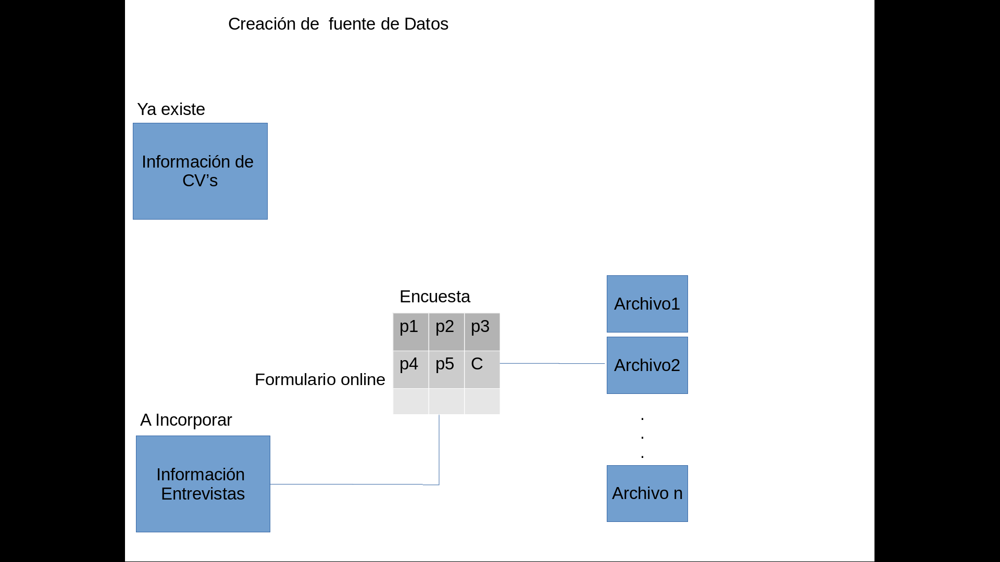
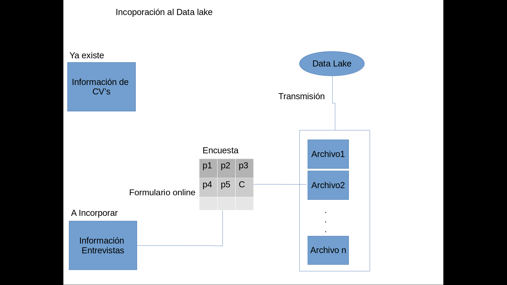
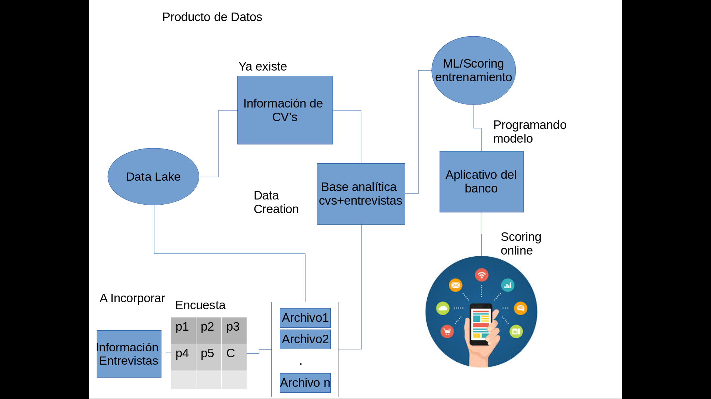
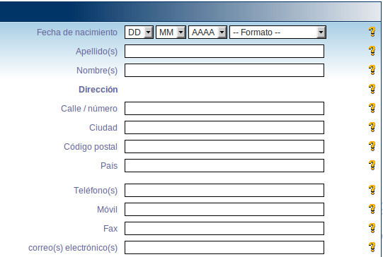
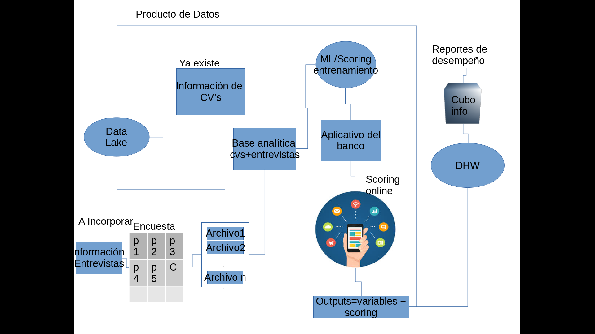

Se desea incorporar al sistema de HR un scoring de cultural fit para que los HR
analysts lo consideren al momento de realizar una oferta a algún candidato.
Diseñe un producto de datos para cubrir esta necesidad:
suponemos el caso es dentro de un Banco muy grande...
1. Desde la definición de los datos necesarios

Datos: es importante obtener información del cv de los aspirantes en concreto información de linkedin es necesaria para la construcción del score, datos como Educación, Formación, habilidades, etc. son indispensables.
Otra parte de fuente de datos se puede extraer de las entrevistas que se les hacen a los candidatos, entonces para darle un poco de orden se puede diseñar un cuestionario para HR que s convierta en una base donde se vacíen respuestas y la evaluación del reclutador.
Datos Necesarios:
del CV.
Id candidato, Edad,Carrera o profesión,posgrados,cursos, años de Estudio, empresas donde laboró, funciones que cumplía, áreas en la que estuvo, decripción de actividades y resposabilidades,nivel de inglés,otros idiomas,certificaciones, Conocimiento de software, habilidades de programación. 
De la entrevista, se resume a recopilar la información de las siguientes preuntas:
¿Qué te atrae de la organización, por qué quieres trabajar aquí?
¿Cómo es tu trabajo ideal?
¿Conoces nuestros valores y principios de empresa?
¿Cuál es tu experiencia en otras empresas con valores similares a los nuestros?
¿Has trabajado en una empresa en la que no te has integrado con su cultura? Cuéntanos tu experiencia.
Calificación del evaluador.

2. La posible fuente si no estuviera dentro de su empresa.

BBVA dentro se su área de HR cuenta con datos actualizados de los empleados con respecto a su preparación y formación así como antiguedad,domicilio,entonces para este caso digamos que la fuente de cvs ya existe dentro de la orgnización, entonces el tema es como anexar a aquellos cvs nuevos, para el tema de los datos de la entrevista es necesario crearla, por tanto se requiere una estrategia de acopio de datos de las encuestas que se van a construir, la solución para incoporar las entrevistas es crear un formulario para los entrevistadores de tal modo que este se pueda guardar en una base de datos relacional para depués en una nueva fuente conjuntarlo con la info de los cv's que ya existe.

3. Cómo incorporar las posibles fuentes al Data Lake

El banco hoy tiene un sistema de encuestas que se regresa mediante archivos de texto con las respuestas, entonces se puede aprovechar ese flujo para recibir los resultados de las entrevistas e ingestar los datos en el Data Lake, incluso como se pueden estructurar para el DWH.

4. El tipo de producto de datos a entregar

El Producto de datos será un ML/what if apps   donde se puedan introducir los datos del entrevistado junto con los resultados de las preguntas que se hagan en la entrevista y la calificación del entrevistador para que de esta manera se pueda scorear al candidato y saber si es o no adecuado para la organización.
Para lograr esto es necesario crear una fuente de datos analítica que nos permita disponer de las variables de los curriculms y de las preguntas de las entrevistas de tal forma que a partir de este momento podamos crear un modelo de scoring supervisado que nos ayude definir a nuestros cadidatos target basados en la información histórica con la que hoy se cuenta para los empleados en el banco.
El banco cuenta con un aplicatvo que alimenta las apps además de otros sistemas entonces esta será la via para que el Modelo de scoring califique a los candidatos, la forma funcional es que una vez que el scoring se ha creado se pueden programar los parámetros del algoritmo ganador, por ejemplo la expresión de la regresión, de red neuronal o árboles de decisión como reglas.

5. Los usuarios de este producto y para qué lo usarán

Los usuarios serán la gente de recursos humanos que entrevista a los candidatos y lo van a usar para al final decidir que candidato es más adeuado para el puesto desde el punto de vista del cultural fit, la idea es que vayan llenando los campos necesarios para calcula el scoring, pudierna tener prelenados los datos del cv y durante la entrevista llenar los de la encuesta y su calificación personal así después de llenarlos tener un scoring final a través de u botón que lo calcule...

6. Si alguna salida o artefacto se debe integrar al DWH y/o a proyectos de la
velocidad 1 o 2. Explique sus decisiones en este último inciso.

Dado que una de las principales herramientas del ML es el entrenamiento de datos es muy importante contar con los regresos de los scores que se hacen para después validar si el score fue o no preciso de acuerdo con las carácteristicas de los candidatos que se buscan(candidatos target), además por supuesto son insumos que sirven para reentrenar los scores, por tanto estos outputs deben ser acopiados  y este es un producto de datos que dado su flujo es de velocidad 2, ahora bien también es importante agregar estas salidas al DWH porque es donde de forma productiva se guarda la información oficial y será necesario que la gente de HR también acceda a estos datos con fines de analizar la selección de los candidatos, a través de reportes de desempeño del scoring, la integración al DHW para alimentar el cubo de información se hace de modo waterfall es decir velocidad1.   

